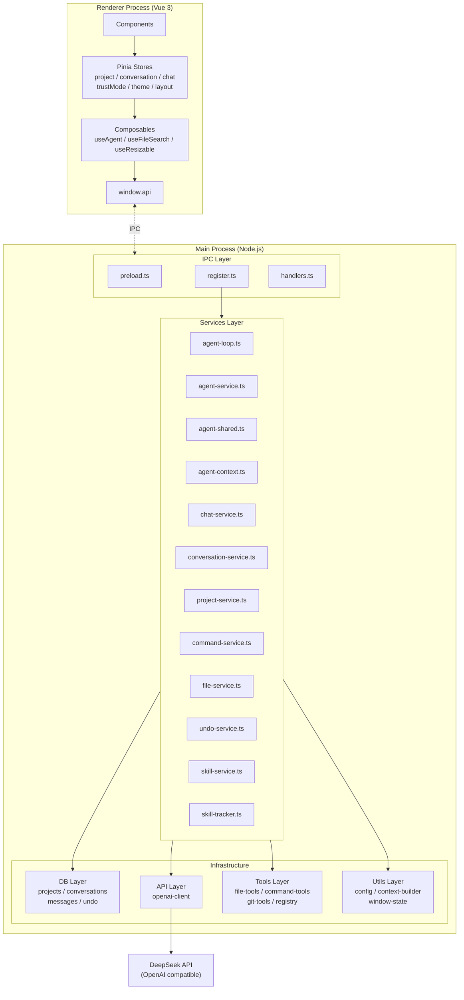
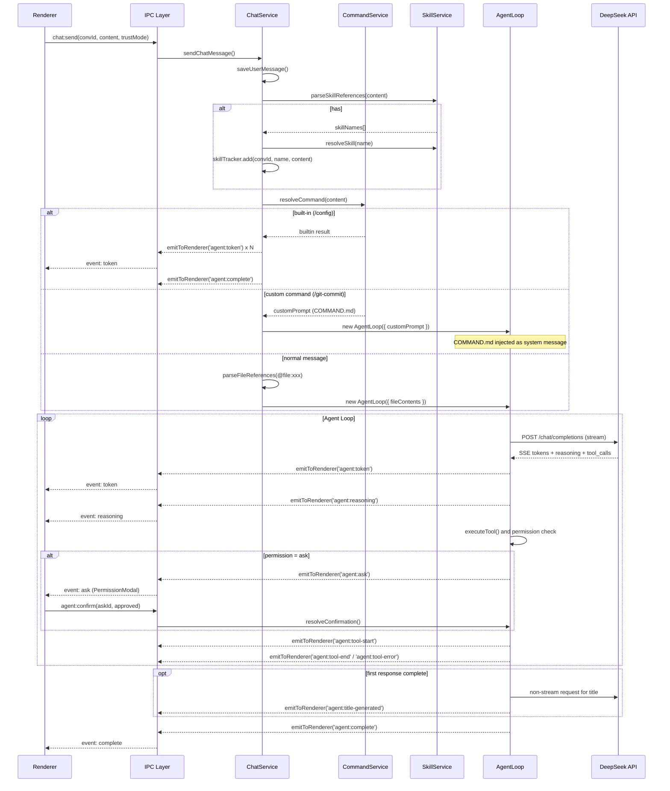
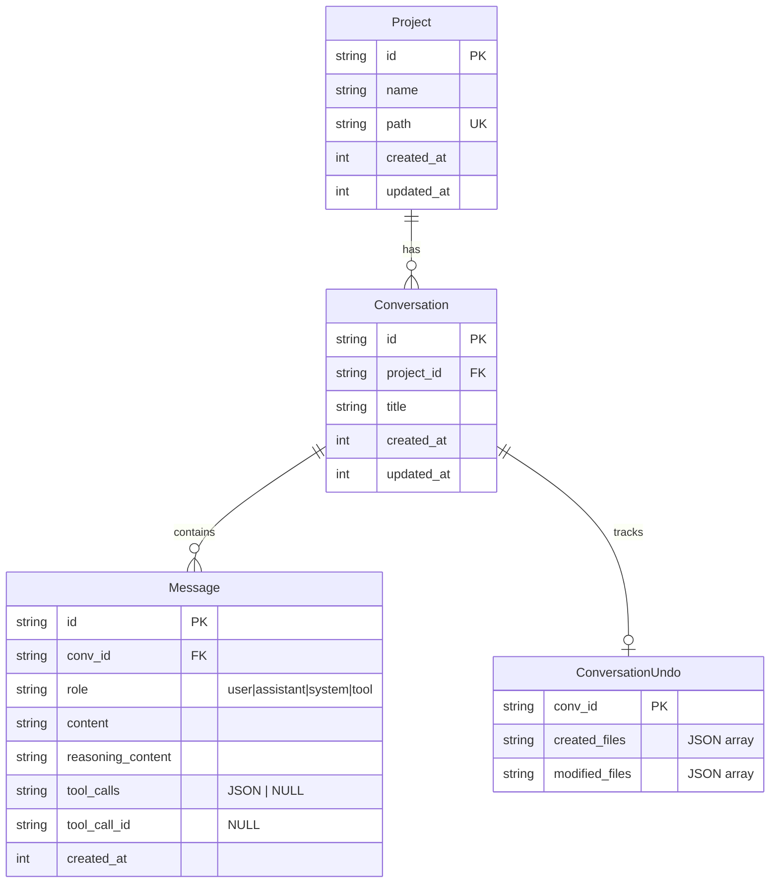
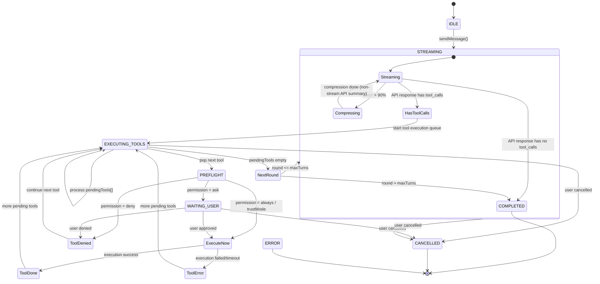
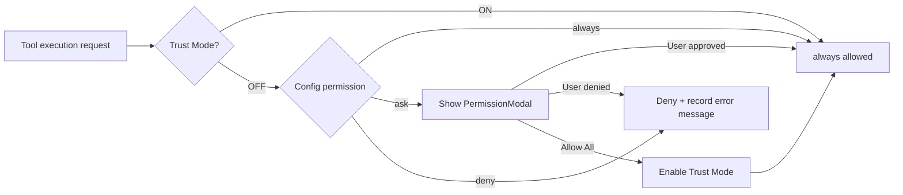

# Coding Agent 架构设计

## 一、整体架构




---

## 二、分层职责

## 2.1 IPC layer (`electron/ipc/`)


| File          | Responsibility                                                                                         |
| ------------- | ------------------------------------------------------------------------------------------------------ |
| `preload.ts`  | Expose `window.api` to renderer via contextBridge: invoke methods + event listeners                    |
| `register.ts` | Register all `ipcMain.handle` as thin forwarding: handle Electron dialog, call service, return result  |
| `handlers.ts` | IPC infrastructure: `registerHandler`, `removeHandler`, `emitToRenderer` (Main to Renderer event push) |


**Constraint:** `register.ts` contains no business logic. Typical handler:

```ts
registerHandler(IPC.PROJECT_LIST, async () => {
  return listAllProjects();
});
```

## 2.2 Services layer (`electron/services/`)

Business logic orchestration, **no Electron API dependency** (dialog, ipcMain, BrowserWindow, etc.).


| File                      | Responsibility                                                                                                                   |
| ------------------------- | -------------------------------------------------------------------------------------------------------------------------------- |
| `agent-loop.ts`           | Agent Loop state machine: stream API calls, tool execution, permission check, context compression, title generation              |
| `agent-service.ts`        | Agent public API: `getAgentStatus`, `setTrustMode`, `resolveConfirmation`                                                        |
| `agent-shared.ts`         | Agent shared constants/state: `TOKEN_LIMIT`, `COMPRESSION_THRESHOLD`, `convTrustMode`, `pendingConfirmations`, `AgentRunOptions` |
| `agent-context.ts`        | `AgentContext` interface + `buildAgentContext` factory                                                                           |
| `chat-service.ts`         | Message sending orchestration: `@file` / `#skill` parsing, command interception, save user message, start/cancel AgentLoop       |
| `conversation-service.ts` | Conversation CRUD, undo cleanup, export data construction, import JSON parsing                                                   |
| `project-service.ts`      | Project CRUD: list, create (from path), delete                                                                                   |
| `command-service.ts`      | Command system: built-in (`/config`), custom (`COMMAND.md`) parsing, command search                                              |
| `file-service.ts`         | File search: recursive directory walk (prefix matching), directory tree generation                                               |
| `undo-service.ts`         | Undo: file backup to `.agents/backups/<convId>/`, restore, cleanup                                                               |
| `skill-service.ts`        | Skill system: YAML frontmatter parsing, `.agents/skills/` directory search, SKILL.md reading                                     |
| `skill-tracker.ts`        | Skill tracking: per-conversation activated skill registry, prevents duplicate injection                                          |


**Data flow (user sends message):**




## 2.3 Utils layer (`electron/utils/`)

Pure function utilities, no side effects, no external service dependencies.


| File                 | Responsibility                                                                                                                                           |
| -------------------- | -------------------------------------------------------------------------------------------------------------------------------------------------------- |
| `config.ts`          | Read `.agents/config.toml`, `env:` prefix resolution, retry range validation [0,5], permission value validation                                          |
| `context-builder.ts` | Build API request context: system prompt (with project structure tree), @file contents, history messages, token estimation (char/4), context compression |
| `window-state.ts`    | Window position/size persistence to `userData/window-state.json`, cross-display visibility check, debounced save                                         |


**System Prompt structure (`context-builder.ts`):**

```
You are Coding Agent, an AI assistant for software development on Windows.
|-- Available Tools
|-- Workflow
|-- Guidelines
|-- Current Project (project path + 2-level directory tree)
```

**Config file format (`.agents/config.toml`):**

```toml
[api]
base_url = "https://api.deepseek.com/v1"
api_key = "env:DEEPSEEK_API_KEY"
model = "deepseek-chat"
retry = 3

[permissions]
read = "always"
write = "ask"
execute = "ask"

max_turns = 50
```

## 2.4 Tools layer (`electron/tools/`)

AI-callable tool implementations (8 total). Each defined in OpenAI function calling format, routed by category.


| File               | Responsibility                                                                                                                      |
| ------------------ | ----------------------------------------------------------------------------------------------------------------------------------- |
| `registry.ts`      | Tool registry: 8 ToolDefinition schemas, `getPermissionCategory`, `executeTool` router                                              |
| `file-tools.ts`    | File ops: `read_file`(line range), `write_file`(auto-create dirs + backup callback), `list_directory`, `glob_search`, `grep_search` |
| `command-tools.ts` | Command execution: `run_command` (PowerShell, 120s timeout, stdout+stderr merged)                                                   |
| `git-tools.ts`     | Git ops: `git_status`(`git status --short`), `git_diff`(`git diff`), 30s timeout                                                    |


**Tool permission categories:**


| Tool             | Category | Notes                        |
| ---------------- | -------- | ---------------------------- |
| `read_file`      | read     | Read file                    |
| `write_file`     | write    | Write file (triggers backup) |
| `list_directory` | read     | List directory               |
| `glob_search`    | read     | Glob pattern search          |
| `grep_search`    | read     | Regex content search         |
| `run_command`    | execute  | Execute command              |
| `git_status`     | read     | Git status                   |
| `git_diff`       | read     | Git diff                     |


All tools enforce path security validation (`resolvePath`), blocking access outside the project root.

## 2.5 API layer (`electron/api/`)


| File               | Responsibility                                                                                                                                                                                                                             |
| ------------------ | ------------------------------------------------------------------------------------------------------------------------------------------------------------------------------------------------------------------------------------------ |
| `openai-client.ts` | OpenAI-compatible HTTP client: `chat()` (non-stream) and `chatStream()` (SSE parsing), tool_calls incremental aggregation, exponential backoff retry (429/5xx), AbortController cancellation, `sanitizeMessages` to strip empty tool_calls |


**SSE parsing highlights:**

- `ReadableStream` reader with line-by-line `data:` prefix parsing
- `reasoning_content` delta as separate event stream
- `tool_calls` incremental aggregation (by index: id/name/arguments)
- Fixed `temperature: 0`

## 2.6 DB layer (`electron/db/`)

Based on better-sqlite3 (sync API, WAL mode, foreign_keys ON).


| File               | Responsibility                                                                        |
| ------------------ | ------------------------------------------------------------------------------------- |
| `connection.ts`    | DB connection init, schema creation, column migration                                 |
| `projects.ts`      | Project CRUD (includes `getProjectByPath`)                                            |
| `conversations.ts` | Conversation CRUD (links `touchProject`)                                              |
| `messages.ts`      | Message CRUD (with `reasoning_content`, `tool_calls` JSON, `getLastAssistantMessage`) |
| `undo.ts`          | Undo state persistence (Upsert mode)                                                  |


**Data model:**




**Indexes:** `idx_messages_conv(conv_id, created_at)`, `idx_conversations_project(project_id, updated_at)`

---

## 三、Core flows

## 3.1 Agent Loop state machine




**Key parameters:**


| Parameter              | Default | Description                                         |
| ---------------------- | ------- | --------------------------------------------------- |
| max_turns              | 50      | Max agent rounds (configurable in config.toml)      |
| TOKEN_LIMIT            | 120000  | DeepSeek V3 128K, leaving buffer                    |
| COMPRESSION_THRESHOLD  | 0.9     | Token ratio triggering context compression          |
| CMD_TIMEOUT            | 120s    | Command execution timeout                           |
| STATUS_THROTTLE        | 500ms   | Status push throttle during token streaming         |
| TOOL_RESULT_TRUNCATION | 5000    | Frontend display truncation length for tool results |


## 3.2 Context compression

Triggers when token count exceeds `TOKEN_LIMIT * COMPRESSION_THRESHOLD`:

1. Enter `compressing` state
2. Generate conversation summary via **non-stream API** call (in Chinese)
3. `compressContext()` retains system prompt + summary + last 5 turns
4. Return to `streaming` state

```ts
// Compressed message structure
[
  systemPrompt,                                       // original system prompt
  { role: "system", content: "<memory>\n{summary}\n</memory>" },
  ...recentMessages,                                  // last 5 user/assistant/tool turns
]
```

## 3.3 Permission model




Two-layer permissions:

- **Config layer**: `.agents/config.toml` `[permissions]` baseline (`read` / `write` / `execute`)
- **Trust Mode layer**: frontend toggle or modal "Allow All" button, IPC to `convTrustMode` Map (per-conversation, lifetime = single AgentLoop)

## 3.4 Streaming events

**Main to Renderer (`webContents.send`):**


| Event                   | Trigger                  | Data                                                             |
| ----------------------- | ------------------------ | ---------------------------------------------------------------- |
| `agent:token`           | Each delta token         | `{ convId, token }`                                              |
| `agent:reasoning`       | Each reasoning delta     | `{ convId, token }`                                              |
| `agent:tool-start`      | Tool execution starts    | `{ convId, toolName, toolCallId, args }`                         |
| `agent:tool-end`        | Tool execution completes | `{ convId, toolCallId, result }` (truncated to 5000 chars)       |
| `agent:tool-error`      | Tool execution fails     | `{ convId, toolCallId, error }`                                  |
| `agent:ask`             | User confirmation needed | `{ convId, askId, toolName, detail }`                            |
| `agent:complete`        | Agent loop ends          | `{ convId }`                                                     |
| `agent:cancelled`       | User cancelled           | `{ convId }`                                                     |
| `agent:error`           | Fatal error              | `{ convId, error }`                                              |
| `agent:status`          | Loop status update       | `AgentStatusSnapshot` (state, round, tokenCount, toolLogs, etc.) |
| `agent:title-generated` | AI generated title       | `{ convId, title }` (title <= 15 characters)                     |


**Renderer to Main (`ipcRenderer.invoke`):**


| Channel               | Description                                                    |
| --------------------- | -------------------------------------------------------------- |
| `project:list`        | Get all projects (by updated_at desc)                          |
| `project:add`         | Open folder picker, add project                                |
| `project:remove`      | Delete project (cascade delete convs + messages)               |
| `conversation:list`   | Get project conversation list                                  |
| `conversation:create` | Create new conversation                                        |
| `conversation:delete` | Delete conversation (with undo cleanup + skill cleanup)        |
| `conversation:rename` | Rename conversation                                            |
| `conversation:undo`   | Undo all file changes (restore backups + delete created files) |
| `conversation:export` | Export conversation as JSON (save dialog)                      |
| `conversation:import` | Import conversation from JSON (file picker)                    |
| `message:list`        | Get conversation messages (by created_at asc)                  |
| `chat:send`           | Send message, start AgentLoop (async, immediate ack)           |
| `chat:cancel`         | Cancel current AgentLoop (abort AbortController)               |
| `agent:confirm`       | User confirms/denies permission                                |
| `agent:set-trust`     | Set per-conversation trust mode                                |
| `agent:status`        | Get agent runtime status snapshot                              |
| `file:search`         | Fuzzy search project files (@ autocomplete, 20 max)            |
| `command:search`      | Search available commands (/ autocomplete, built-in + custom)  |
| `skill:search`        | Search available skills (# autocomplete)                       |
| `config:read`         | Read project `.agents/config.toml` config                      |


---

## 四、Commands system

## 4.1 Overview

Two command types: built-in (hardcoded) and custom (`COMMAND.md`).

```
.agents/
|-- config.toml
|-- commands/
|   `-- git-commit/
|       `-- COMMAND.md
|-- skills/
|   `-- frontend-design/
|       `-- SKILL.md
`-- backups/
    `-- <convId>/
```

## 4.2 Command resolution flow

```mermaid
flowchart TD
    A[User enters /xxx] --> B{Built-in?}
    B -->|Yes| C[Local execute /config]
    C --> D[Return result (char-by-char token push)]
    B -->|No| E{.agents/commands/xxx/COMMAND.md exists?}
    E -->|Yes| F[Read COMMAND.md]
    F --> G[Inject as system message]
    G --> H[Start AgentLoop]
    E -->|No| I[Send to AI as-is]
```


## 4.3 Built-in commands


| Command   | Behavior                                                                     |
| --------- | ---------------------------------------------------------------------------- |
| `/config` | Create `.agents/` + `config.toml` (if missing), or merge missing config keys |


## 4.4 Custom commands

`COMMAND.md` content injected as system prompt at the front of AI context.

Input `/git-commit` or `/git-commit extra notes` triggers it (`/command` prefix removed, extra text becomes `userContent`).

## 4.5 Frontend autocomplete

- Type `/` to show command dropdown (built-in + custom), Tab/Enter to select
- Type `#` to search `.agents/skills/` directory, show skill list
- Type `@` to search project files, recursive fuzzy matching

---

## 五、Skills system

## 5.1 Overview

Skills defined in `.agents/skills/<name>/SKILL.md`, format: YAML frontmatter + Markdown body:

```markdown
---
name: frontend-design
description: Create distinctive, production-grade frontend interfaces...
---

# Frontend Design Skill

## Workflow
1. ...
```

## 5.2 Skill activation and injection

1. User enters `#skillname` to activate a skill
2. `chat-service.ts` calls `skillTracker.add(convId, name, content)`
3. On each AgentLoop start, all tracked conversation skills are injected as system messages in reverse order (after custom prompt)
4. Same skill is never injected twice in the same conversation

## 5.3 Frontend autocomplete

On `#`, `skill-service.searchSkills()` scans `.agents/skills/` subdirectories, parses `SKILL.md` frontmatter, returns `{ name, description }`.

---

## 六、Directory structure

```
coding-agent/
|-- docs/
|   |-- architecture.md
|   `-- TODO.md
|-- shared/
|   `-- types.ts
|-- electron/
|   |-- main.ts
|   |-- preload.ts
|   |-- ipc/
|   |   |-- register.ts
|   |   `-- handlers.ts
|   |-- services/
|   |   |-- agent-loop.ts
|   |   |-- agent-service.ts
|   |   |-- agent-shared.ts
|   |   |-- agent-context.ts
|   |   |-- chat-service.ts
|   |   |-- conversation-service.ts
|   |   |-- project-service.ts
|   |   |-- command-service.ts
|   |   |-- file-service.ts
|   |   |-- undo-service.ts
|   |   |-- skill-service.ts
|   |   `-- skill-tracker.ts
|   |-- tools/
|   |   |-- registry.ts
|   |   |-- file-tools.ts
|   |   |-- command-tools.ts
|   |   `-- git-tools.ts
|   |-- api/
|   |   `-- openai-client.ts
|   |-- db/
|   |   |-- connection.ts
|   |   |-- projects.ts
|   |   |-- conversations.ts
|   |   |-- messages.ts
|   |   `-- undo.ts
|   `-- utils/
|       |-- config.ts
|       |-- context-builder.ts
|       `-- window-state.ts
|-- src/
|   |-- App.vue
|   |-- main.ts
|   |-- env.d.ts
|   |-- components/
|   |   |-- layout/       (AppLayout, ErrorBoundary, ThemeToggle, ResizeHandle)
|   |   |-- sidebar/      (ProjectList, ConversationList)
|   |   |-- chat/          (ChatWindow, MessageList, MessageBubble, ToolCallCard, InputBox)
|   |   |-- modals/        (PermissionModal)
|   |   |-- diff/          (DiffViewer)
|   |   `-- dev/           (DevPanel)
|   |-- stores/            (project, conversation, chat, trustMode, theme, layout)
|   |-- composables/       (useAgent, useFileSearch, useResizable)
|   |-- types/             (message)
|   `-- styles/            (theme.css)
|-- .agents/
|   |-- config.toml
|   |-- commands/
|   `-- skills/
|-- resources/
|-- index.html
|-- package.json
|-- vite.config.ts
|-- tsconfig.json / .node / .web
`-- electron-builder.json5
```

---

## 七、Tech stack


| Layer          | Tech                                           |
| -------------- | ---------------------------------------------- |
| Desktop        | Electron 33                                    |
| Frontend       | Vue 3 + TypeScript + Pinia + Vite              |
| Backend        | Node.js (Electron Main Process)                |
| Database       | better-sqlite3 (WAL, sync API, foreign_keys)   |
| HTTP client    | fetch (Node 20 built-in)                       |
| Markdown       | marked                                         |
| Config         | smol-toml                                      |
| UUID           | uuid                                           |
| File search    | glob (npm)                                     |
| Build          | vite-plugin-electron + electron-builder (NSIS) |
| Code quality   | ESLint + Prettier + vue-tsc                    |
| AI API         | DeepSeek (OpenAI compatible)                   |
| Native rebuild | electron-rebuild (better-sqlite3, postinstall) |


---

## 八、Key design decisions

1. **Agent service split into 4 files**: `agent-loop` (state machine), `agent-service` (public API), `agent-shared` (shared state/constants), `agent-context` (context construction). Avoids single-file bloat with clear separation of concerns.
2. **Skill system vs Command system**: `/command` is one-shot (COMMAND.md re-read each trigger), `#skill` is persistent (active for entire conversation lifecycle, tracked by `skill-tracker`).
3. **Context compression uses non-stream API**: Summary generation is a short completion task; non-stream avoids SSE parsing overhead and is more reliable.
4. **Permission model is tool-category based** (read/write/execute), not per-tool. This keeps the config simple while giving users meaningful control.
5. **Undo via file backup**: Before every `write_file`, the original file content is copied to `.agents/backups/<convId>/`. Undo restores backups and deletes newly created files.
6. **Title generation is fire-and-forget**: Non-blocking async call after first assistant response; failure is silently ignored.
7. **Tool results truncated for frontend display**: Full results saved to DB, but UI display capped at 5000 characters to avoid rendering huge tool outputs.
8. `**temperature: 0` fixed**: All API calls use `temperature: 0` for deterministic, predictable behavior.

