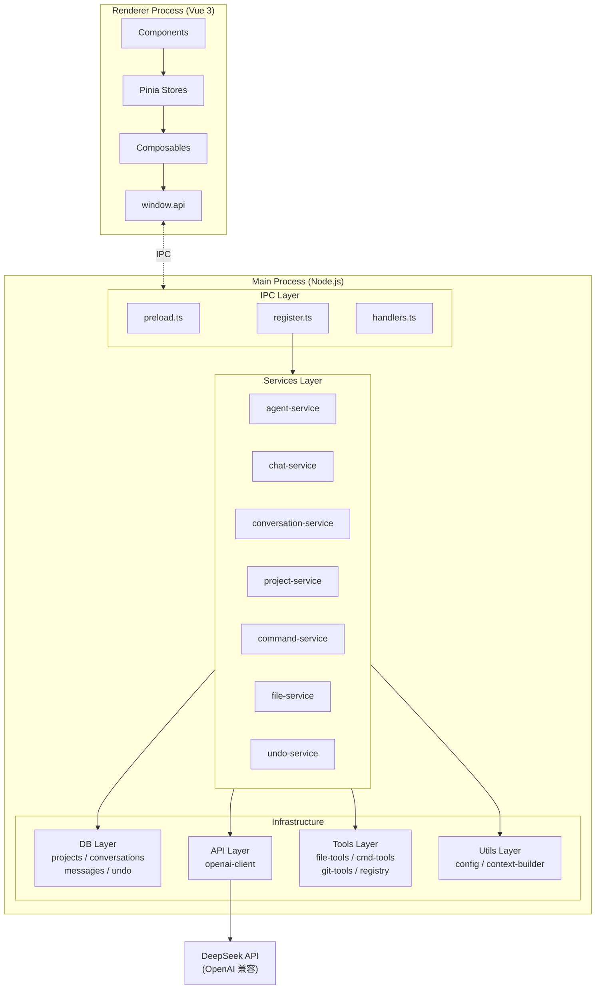
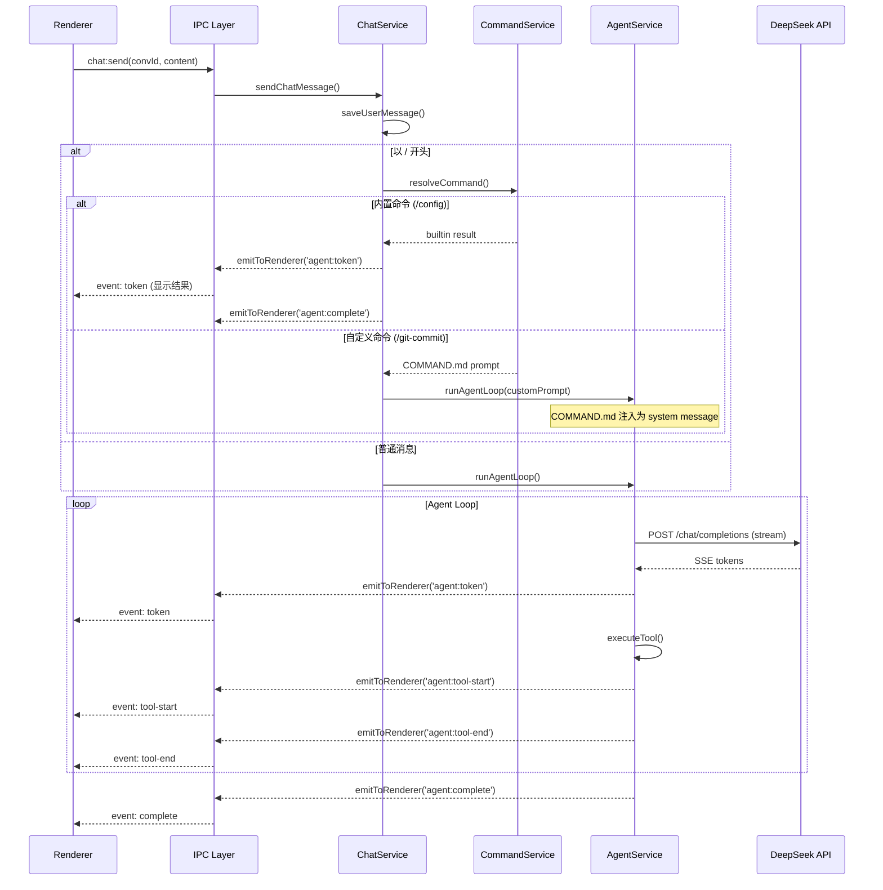
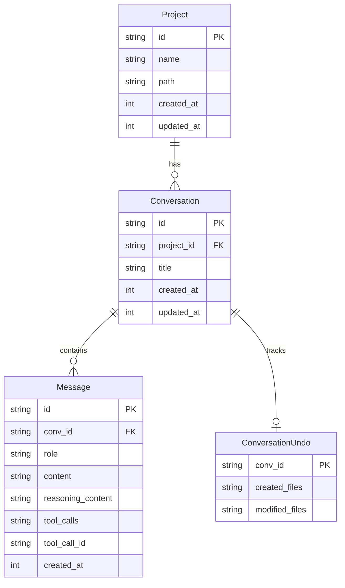
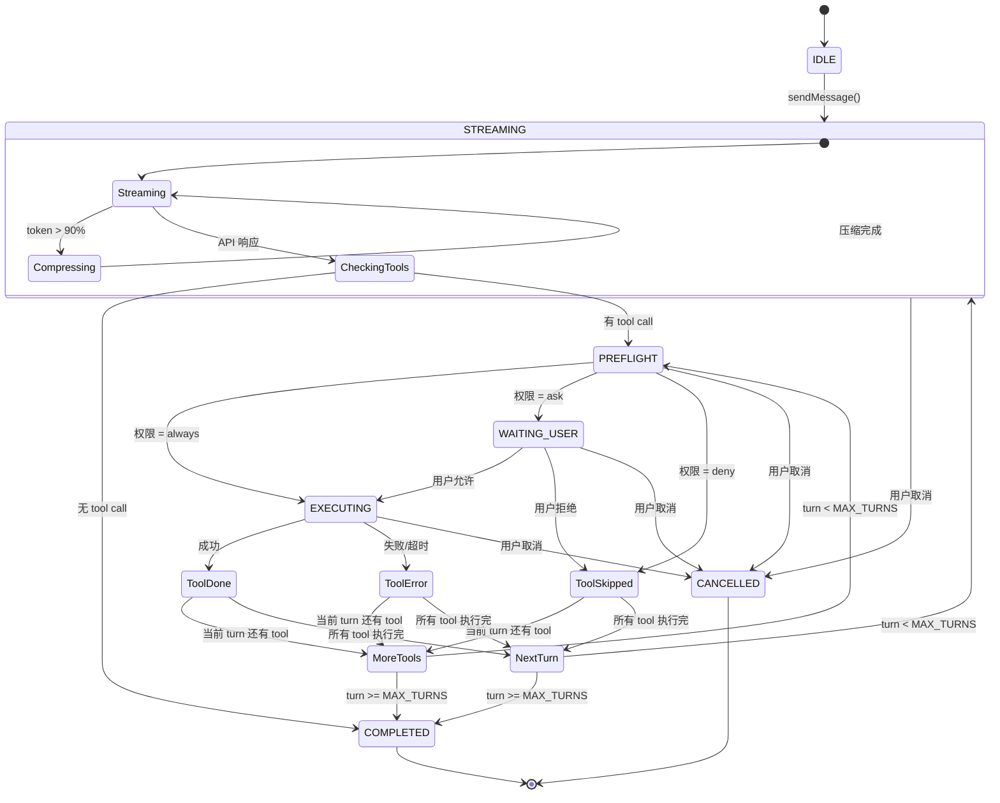
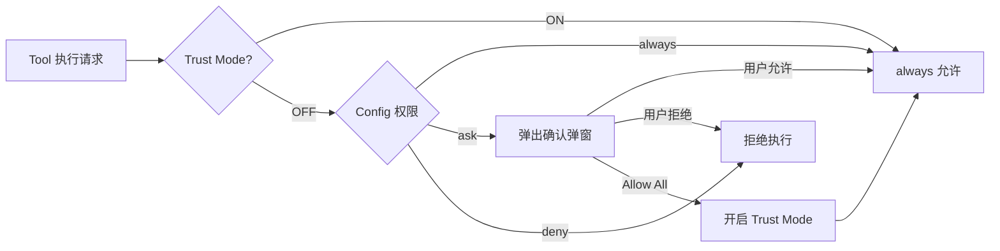
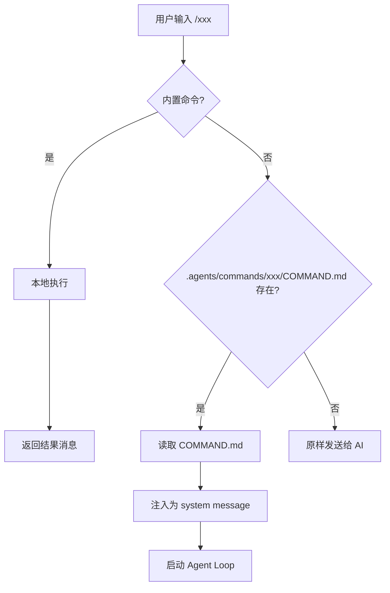

# Coding Agent — 后端架构设计

## 一、整体架构



---

## 二、分层职责

### 2.1 IPC 层 (`electron/ipc/`)

| 文件          | 职责                                                                                    |
| ------------- | --------------------------------------------------------------------------------------- |
| `preload.ts`  | 暴露 `window.api` 给渲染进程（contextBridge），定义所有可用 IPC 通道                    |
| `register.ts` | 注册所有 `ipcMain.handle`，**只做薄转发**：处理 Electron dialog、调用 service、返回结果 |
| `handlers.ts` | IPC 注册工具：`registerHandler`、`emitToRenderer`（Main → Renderer 事件推送）           |

**约束：** register.ts 不包含任何业务逻辑。典型 handler 写法：

```ts
registerHandler(IPC.PROJECT_LIST, async () => {
  return listAllProjects(); // 1 行委托
});
```

### 2.2 Services 层 (`electron/services/`)

业务逻辑编排层，**不依赖 Electron API**（dialog、ipcMain、BrowserWindow 等）。

| 文件                      | 职责                                                                   |
| ------------------------- | ---------------------------------------------------------------------- |
| `agent-service.ts`        | Agent 循环编排：构建上下文 → 调用 API → 执行工具 → 权限检查 → 流式推送 |
| `chat-service.ts`         | 消息发送：命令拦截、@file 引用解析、保存用户消息、启动/取消 agent loop |
| `conversation-service.ts` | 对话管理：CRUD、undo 清理、导出数据构建、导入数据解析                  |
| `project-service.ts`      | 项目管理：列表、创建（从路径）、删除                                   |
| `command-service.ts`      | 命令系统：内置命令（/config）、自定义命令解析、命令搜索                |
| `file-service.ts`         | 文件搜索：递归目录遍历、模糊匹配                                       |
| `undo-service.ts`         | 撤销管理：文件备份、恢复、清理                                         |

**数据流示例（用户发送消息）：**



### 2.3 Utils 层 (`electron/utils/`)

纯函数工具，无副作用，无外部服务依赖。

| 文件        | 职责                                                                 |
| ----------- | -------------------------------------------------------------------- |
| `config.ts` | 读取 `.agents/config.toml`，`env:` 前缀解析，权限/重试/maxTurns 校验 |

**配置文件格式 (`.agents/config.toml`)：**

```toml
[api]
base_url = "https://api.deepseek.com/v1"
api_key = "env:DEEPSEEK_API_KEY"   # env: 前缀 = 读环境变量
model = "deepseek-chat"
retry = 3                          # [0, 5]

[permissions]
read = "always"                    # always | ask | deny
write = "ask"
execute = "ask"

max_turns = 50                     # 最大 agent 轮次，默认 50
```

| `context-builder.ts` | 构建 API 请求上下文：system prompt、项目结构树、@file 内容、历史消息、token 估算、上下文压缩 |

### 2.4 Tools 层 (`electron/tools/`)

AI 可调用的工具实现。每个 tool 以 OpenAI function calling 格式定义。

| 文件               | 职责                                                                                |
| ------------------ | ----------------------------------------------------------------------------------- |
| `registry.ts`      | 工具注册表：定义所有 tool 的 schema、权限分类、执行路由                             |
| `file-tools.ts`    | 文件操作：`read_file`、`write_file`、`list_directory`、`glob_search`、`grep_search` |
| `command-tools.ts` | 命令执行：`run_command`（PowerShell，120s 超时）                                    |
| `git-tools.ts`     | Git 操作：`git_status`、`git_diff`                                                  |

### 2.5 API 层 (`electron/api/`)

| 文件               | 职责                                                                                                                  |
| ------------------ | --------------------------------------------------------------------------------------------------------------------- |
| `openai-client.ts` | OpenAI 兼容 HTTP 客户端：流式/非流式 chat、SSE 解析、重试（指数退避）、AbortController 支持、`reasoning_content` 捕获 |

### 2.6 DB 层 (`electron/db/`)

基于 better-sqlite3（同步 API，WAL 模式）。

| 文件               | 职责                                |
| ------------------ | ----------------------------------- |
| `connection.ts`    | 数据库连接初始化、Schema 创建、迁移 |
| `projects.ts`      | 项目 CRUD                           |
| `conversations.ts` | 对话 CRUD                           |
| `messages.ts`      | 消息 CRUD（含 `reasoning_content`） |
| `undo.ts`          | 撤销状态持久化                      |

**数据模型：**



---

## 三、核心流程

### 3.1 Agent Loop 状态机



**关键参数：**
| 参数 | 默认值 | 说明 |
|------|--------|------|
| max_turns | 50 | 最大 agent 轮次（可在 config.toml 中配置） |
| TOKEN_LIMIT | 120000 | DeepSeek V3 128K，留 buffer |
| COMPRESSION_THRESHOLD | 90% | 触发上下文压缩的 token 比例 |
| CMD_TIMEOUT | 120s | 命令执行超时 |

### 3.2 权限模型



双层权限：

- **Config 层**：`.agents/config.toml` 中的 `[permissions]` 基线
- **Trust Mode 层**：前端 toggle 或 "Allow All This Turn" 按钮 → IPC → `convTrustMode` Map

### 3.3 流式事件

**Main → Renderer 事件：**

| 事件                    | 触发时机         | 携带数据                                    |
| ----------------------- | ---------------- | ------------------------------------------- |
| `agent:token`           | 每个 delta token | `{ convId, token }`                         |
| `agent:tool-start`      | 工具开始执行     | `{ convId, toolName, toolCallId, args }`    |
| `agent:tool-end`        | 工具执行完成     | `{ convId, toolCallId, result }`            |
| `agent:tool-error`      | 工具执行失败     | `{ convId, toolCallId, error }`             |
| `agent:ask`             | 需要用户确认     | `{ convId, askId, toolName, detail }`       |
| `agent:complete`        | Agent loop 结束  | `{ convId }`                                |
| `agent:cancelled`       | 用户取消         | `{ convId }`                                |
| `agent:error`           | 致命错误         | `{ convId, error }`                         |
| `agent:status`          | Loop 状态更新    | `{ convId, state, round, tokenCount, ... }` |
| `agent:title-generated` | AI 生成标题      | `{ convId, title }`                         |

**Renderer → Main（invoke）：**

| 通道                  | 说明                                            |
| --------------------- | ----------------------------------------------- |
| `project:list`        | 获取所有项目                                    |
| `project:add`         | 打开文件夹选择器，添加项目                      |
| `project:remove`      | 删除项目                                        |
| `conversation:list`   | 获取项目下的对话列表                            |
| `conversation:create` | 创建新对话                                      |
| `conversation:delete` | 删除对话                                        |
| `conversation:rename` | 重命名对话                                      |
| `conversation:undo`   | 撤销对话中的文件修改                            |
| `conversation:export` | 导出对话为 JSON                                 |
| `conversation:import` | 从 JSON 导入对话                                |
| `message:list`        | 获取对话的消息列表                              |
| `chat:send`           | 发送消息、启动 agent loop（异步，立即返回 ack） |
| `chat:cancel`         | 取消当前 agent loop                             |
| `agent:confirm`       | 用户确认/拒绝权限                               |
| `agent:set-trust`     | 设置 trust mode                                 |
| `agent:status`        | 获取 agent 运行状态                             |
| `file:search`         | 模糊搜索项目文件（@ 补全）                      |
| `command:search`      | 搜索可用命令（/ 补全）                          |
| `config:read`         | 读取项目配置                                    |

---

## 四、Commands 系统

### 4.1 概述

支持两类命令：内置命令（硬编码）和自定义命令（`COMMAND.md`）。

```
.agents/
├── config.toml
└── commands/              ← 用户自定义命令
    └── git-commit/
        └── COMMAND.md     ← 命令指令（Markdown）
```

### 4.2 命令解析流程



### 4.3 内置命令

| 命令      | 行为                                                                |
| --------- | ------------------------------------------------------------------- |
| `/config` | 创建 `.agents/` + `config.toml`（如不存在），已存在则追加缺失配置项 |

### 4.4 自定义命令

`COMMAND.md` 内容作为 system prompt 注入到 AI 上下文最前面，AI 据此执行。

示例 `.agents/commands/git-commit/COMMAND.md`：

```markdown
# Git Commit

Analyze the current git diff and generate a concise commit message.
Then execute:
git add .
git commit -m "<message>"

Guidelines:

- Use conventional commits format (feat/fix/refactor/etc.)
- Keep message under 72 characters
```

输入 `/git-commit` 或 `/git-commit 额外说明` 触发。

### 4.5 前端补全

输入 `/` 自动弹出命令下拉列表（内置 + 自定义），Tab/Enter 选择，↑↓ 导航。

---

## 五、目录结构

```
coding-agent/
├── docs/
│   └── architecture.md          ← 本文档
├── shared/
│   └── types.ts                 ← 前后端共享类型
├── electron/                    ← Main Process
│   ├── main.ts                  ← 入口：窗口创建、IPC 注册、DB 生命周期
│   ├── preload.ts               ← contextBridge API
│   ├── ipc/
│   │   ├── register.ts          ← IPC handler 注册（薄转发）
│   │   └── handlers.ts          ← 注册/事件工具函数
│   ├── services/                ← 业务逻辑编排
│   │   ├── agent-service.ts     ← Agent Loop
│   │   ├── chat-service.ts      ← 消息发送 + 命令拦截
│   │   ├── conversation-service.ts ← 对话管理
│   │   ├── project-service.ts   ← 项目管理
│   │   ├── command-service.ts   ← 命令系统
│   │   ├── file-service.ts      ← 文件搜索
│   │   └── undo-service.ts      ← 撤销管理
│   ├── tools/                   ← AI 可调用工具
│   │   ├── registry.ts          ← 工具注册 + schema
│   │   ├── file-tools.ts
│   │   ├── command-tools.ts
│   │   └── git-tools.ts
│   ├── api/
│   │   └── openai-client.ts     ← OpenAI 兼容 HTTP 客户端
│   ├── db/                      ← 数据访问层
│   │   ├── connection.ts        ← 连接 + schema
│   │   ├── projects.ts
│   │   ├── conversations.ts
│   │   ├── messages.ts
│   │   └── undo.ts
│   └── utils/                   ← 纯函数工具
│       ├── config.ts            ← .agents/config.toml 解析
│       └── context-builder.ts   ← API context 构建
├── src/                         ← Renderer Process (Vue 3)
│   ├── App.vue
│   ├── main.ts
│   ├── components/
│   │   ├── layout/       (AppLayout, ErrorBoundary)
│   │   ├── sidebar/      (ProjectList, ConversationList)
│   │   ├── chat/          (ChatWindow, MessageList, MessageBubble, InputBox)
│   │   ├── modals/        (PermissionModal)
│   │   └── dev/           (DevPanel)
│   ├── stores/            (project, conversation, chat, trustMode)
│   ├── composables/       (useAgent, useFileSearch)
│   └── types/             (message)
├── resources/
├── package.json
├── vite.config.ts
├── tsconfig.json / .node / .web
└── electron-builder.json5
```

---

## 六、技术栈

| 层          | 技术                              |
| ----------- | --------------------------------- |
| 桌面框架    | Electron 33                       |
| 前端        | Vue 3 + TypeScript + Pinia + Vite |
| 后端        | Node.js (Electron Main Process)   |
| 数据库      | better-sqlite3 (WAL, 同步 API)    |
| HTTP 客户端 | fetch (Node 20 内置)              |
| Markdown    | marked                            |
| 配置解析    | smol-toml                         |
| 文件搜索    | glob (npm)                        |
| 构建        | electron-builder (NSIS)           |
| AI API      | DeepSeek (OpenAI 兼容)            |
